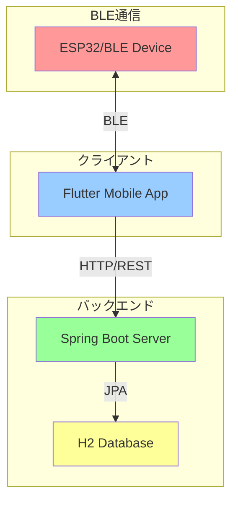
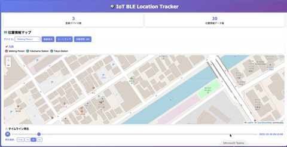
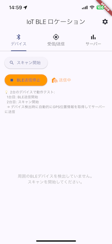
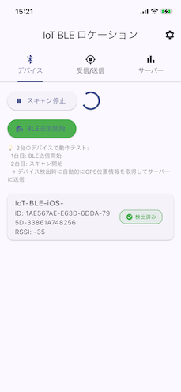
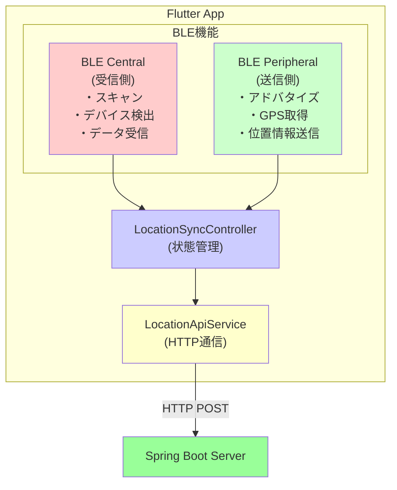
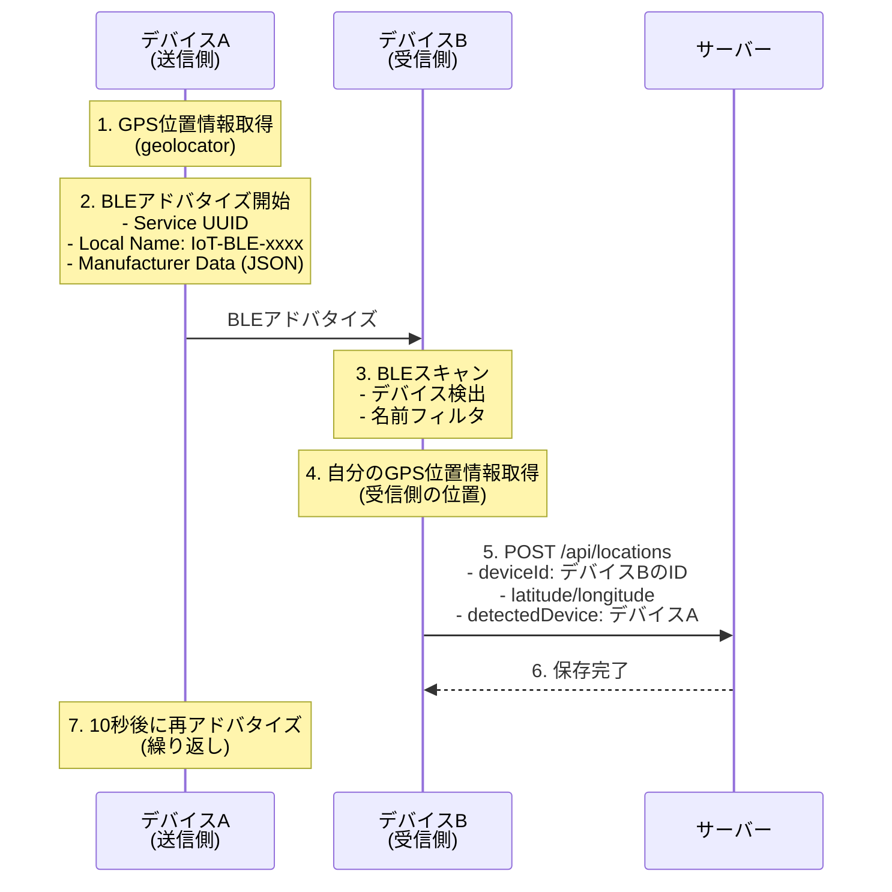
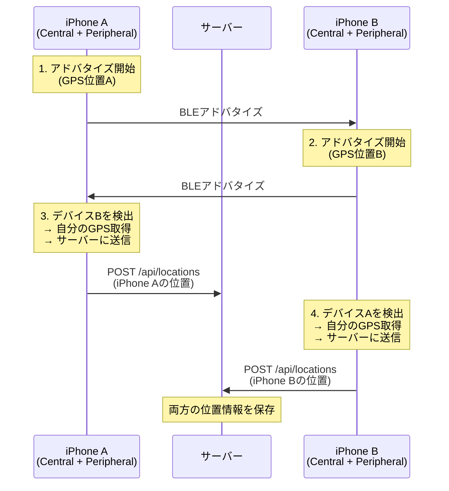

# IoT BLE Location System

BLEデバイスから位置情報を収集し、リアルタイムで追跡・管理するIoTシステム

---

## 目次

- [概要](#概要)
- [システム構成](#システム構成)
- [主な機能](#主な機能)
- [プロジェクト構成](#プロジェクト構成)
- [クイックスタート](#クイックスタート)
  - [サーバーの起動](#1-サーバーの起動)
  - [Flutterアプリの起動](#2-flutterアプリの起動)
- [技術スタック](#技術スタック)
- [API仕様](#api仕様)
- [詳細設定ガイド](#詳細設定ガイド)
  - [Flutterアプリの設定](#flutterアプリの設定)
  - [iOS HTTP通信設定](#ios-http通信設定)
- [開発ガイド](#開発ガイド)
- [テスト戦略](#テスト戦略)
- [トラブルシューティング](#トラブルシューティング)
- [セキュリティ](#セキュリティ)
- [デプロイ](#デプロイ)
- [ライセンス](#ライセンス)

---

## 概要

このプロジェクトは、ESP32などのBLEデバイスから位置情報を収集し、Spring Bootサーバーで管理、Flutterモバイルアプリで可視化する統合IoTシステムです。

## システム構成



## 主な機能

### サーバー側（Spring Boot）



- RESTful API による位置情報の管理
- H2 インメモリデータベースでのデータ永続化
- デバイス別・時間範囲別の位置情報検索
- 統計情報の提供（デバイス数、データ数など）
- Thymeleafによる Web UI
- 包括的なユニットテスト（正常系・異常系・境界値・エッジケース）
- インターフェースベースのDI設計

### クライアント側（Flutter）

 

#### 主要機能

- BLE Central機能（受信側）
  - BLEデバイスのスキャンと自動検出
  - デバイス名フィルタリング（`IoT-BLE-`プレフィックス）
  - 位置情報のリアルタイム受信
  - サーバーへの自動送信
  
- BLE Peripheral機能（送信側）
  - GPS位置情報の定期的なアドバタイズ（10秒間隔）
  - 実際のGPS座標を使用
  - バックグラウンド対応（最後の成功位置をキャッシュ）
  
- その他機能
  - 統計情報の表示
  - 環境別のサーバーURL設定
  - 設定・デバッグ画面
  - 包括的な権限管理（Bluetooth、位置情報、ローカルネットワーク）

## プロジェクト構成

```text
iot-ble-location-system/
├── server/                 # Spring Boot サーバー
│   ├── src/
│   │   ├── main/
│   │   │   ├── java/
│   │   │   │   └── com/example/iotble/
│   │   │   │       ├── controller/      # REST コントローラー
│   │   │   │       ├── service/         # ビジネスロジック
│   │   │   │       ├── repository/      # データアクセス
│   │   │   │       └── model/           # データモデル
│   │   │   └── resources/
│   │   │       ├── application.yml      # サーバー設定
│   │   │       └── templates/           # Thymeleaf テンプレート
│   │   └── test/                        # ユニットテスト
│   └── pom.xml                          # Maven 設定
│
├── flutter-app/            # Flutter モバイルアプリ
│   ├── lib/
│   │   ├── config/         # アプリ設定
│   │   ├── models/         # データモデル
│   │   ├── providers/      # 状態管理
│   │   ├── screens/        # UI画面
│   │   └── services/       # BLE・API通信
│   ├── android/            # Android固有設定
│   ├── ios/                # iOS固有設定
│   └── pubspec.yaml        # Flutter依存関係
│
└── README.md               # このファイル
```

---

## クイックスタート

### 前提条件

#### サーバー側

- Java 21
- Maven 3.6+

#### クライアント側

- Flutter 3.5.0+
- Android Studio / Xcode
- Android SDK / iOS SDK

### 1. サーバーの起動

```bash
cd server

# ビルド
mvn clean install

# 起動
mvn spring-boot:run
```

サーバーは `http://localhost:8080` で起動します。

#### サーバーの動作確認

```bash
# 統計情報を取得
curl http://localhost:8080/api/stats

# Web UIにアクセス
open http://localhost:8080
```

### 2. Flutterアプリの起動

#### Androidエミュレータ

```bash
cd flutter-app

# 依存関係のインストール
flutter pub get

# 起動
./run_android_emulator.sh
```

#### iOSシミュレータ

```bash
cd flutter-app

# 起動（デフォルト: 192.168.0.15）
./run_ios_simulator.sh

# IPアドレスを指定
./run_ios_simulator.sh 192.168.0.20
```

注意: iOSでは `Info.plist` で許可されたIPアドレスのみHTTP通信が可能です。詳細は [iOS HTTP通信設定](#ios-http通信設定) を参照してください。

#### 実機

```bash
cd flutter-app

# 開発マシンのIPアドレスを確認
ifconfig | grep "inet " | grep -v 127.0.0.1

# 起動（デフォルト: 192.168.0.15）
./run_real_device.sh

# IPアドレスを指定
./run_real_device.sh 192.168.0.20
```

---

## 技術スタック

### サーバー側

| 技術 | バージョン | 用途 |
|------|-----------|------|
| Java | 21 | プログラミング言語 |
| Spring Boot | 3.5.7 | アプリケーションフレームワーク |
| Spring Data JPA | 3.5.7 | データアクセス |
| H2 Database | 2.3.232 | インメモリデータベース |
| Lombok | 1.18.36 | ボイラープレートコード削減 |
| Thymeleaf | 3.1.3 | テンプレートエンジン |
| JUnit 5 | 5.11.4 | ユニットテスト |
| Mockito | 5.14.2 | モックフレームワーク |

### クライアント側

| 技術 | バージョン | 用途 |
|------|-----------|------|
| Flutter | 3.5.0+ | UIフレームワーク |
| flutter_blue_plus | ^1.32.0 | BLE通信 |
| http | ^1.2.0 | HTTP通信 |
| provider | ^6.1.0 | 状態管理 |
| permission_handler | ^11.3.0 | 権限管理 |

---

## API仕様

### エンドポイント一覧

| メソッド | エンドポイント | 説明 |
|---------|---------------|------|
| POST | `/api/locations` | 位置情報を登録 |
| GET | `/api/locations` | すべての位置情報を取得 |
| GET | `/api/locations/{id}` | 指定IDの位置情報を取得 |
| GET | `/api/locations/device/{deviceId}` | デバイス別の位置情報を取得 |
| GET | `/api/locations/device/{deviceId}/latest` | デバイスの最新位置情報を取得 |
| GET | `/api/locations/recent` | 最新50件の位置情報を取得 |
| GET | `/api/locations/range` | 期間指定で位置情報を取得 |
| DELETE | `/api/locations/{id}` | 位置情報を削除 |
| GET | `/api/stats` | 統計情報を取得 |

### リクエスト例

#### 位置情報の登録

```bash
curl -X POST http://localhost:8080/api/locations \
  -H "Content-Type: application/json" \
  -d '{
    "deviceId": "ESP32-001",
    "latitude": 35.6812,
    "longitude": 139.7671,
    "accuracy": 10.5,
    "timestamp": "2025-10-29T12:00:00"
  }'
```

#### 統計情報の取得

```bash
curl http://localhost:8080/api/stats
```

レスポンス:

```json
{
  "totalLocations": 150,
  "deviceCount": 5,
  "latestUpdate": "2025-10-29T12:00:00"
}
```

---

## 詳細設定ガイド

### Flutterアプリの設定

#### サーバーURL設定

このアプリは `--dart-define` を使用してビルド時にサーバーURLを設定します。

##### 設定可能なパラメータ

| パラメータ | 説明 | デフォルト値 |
|-----------|------|-------------|
| `API_BASE_URL` | Spring BootサーバーのベースURL | プラットフォーム依存 |
| `HTTP_TIMEOUT` | HTTPリクエストのタイムアウト（秒） | `30` |
| `DEBUG_MODE` | デバッグモードの有効/無効 | `false` |

##### 実行方法

- Androidエミュレータ

エミュレータからホストマシンの `localhost` にアクセスする場合、特別なIPアドレス `10.0.2.2` を使用します。

```bash
cd flutter-app

# スクリプトを使用
./run_android_emulator.sh

# または直接実行
flutter run --dart-define=API_BASE_URL=http://10.0.2.2:8080
```

- iOSシミュレータ

シミュレータからホストマシンにアクセスする場合、開発マシンのIPアドレスを使用します。

重要: iOSでは `Info.plist` で許可されたIPアドレスのみHTTP通信が可能です。デフォルトでは `192.168.0.15` が設定されています。

```bash
cd flutter-app

# スクリプトを使用（デフォルト: 192.168.0.15）
./run_ios_simulator.sh

# IPアドレスを指定
./run_ios_simulator.sh 192.168.0.20

# または直接実行
flutter run --dart-define=API_BASE_URL=http://192.168.0.15:8080
```

- 実機（Android/iOS）

実機から開発マシンにアクセスする場合、開発マシンのローカルネットワーク上のIPアドレスを指定します。

```bash
cd flutter-app

# スクリプトを使用（デフォルト: 192.168.0.15）
./run_real_device.sh

# IPアドレスを指定
./run_real_device.sh 192.168.0.20

# または直接実行
flutter run --dart-define=API_BASE_URL=http://192.168.0.15:8080
```

iOS実機の場合: 新しいIPアドレスを使用する場合は、`flutter-app/ios/Runner/Info.plist` の `NSExceptionDomains` に追加してください。

- 開発マシンのIPアドレスを確認する方法

```bash
# macOS/Linux
ifconfig | grep "inet " | grep -v 127.0.0.1

# Windows
ipconfig | findstr IPv4
```

- 本番環境向けビルド

```bash
cd flutter-app

# Android APK
flutter build apk --dart-define=API_BASE_URL=https://api.example.com

# iOS IPA
flutter build ios --dart-define=API_BASE_URL=https://api.example.com
```

##### VS Code での設定

`.vscode/launch.json` に設定を追加することで、VS Code から直接実行できます

```json
{
  "version": "0.2.0",
  "configurations": [
    {
      "name": "Flutter (Android Emulator)",
      "request": "launch",
      "type": "dart",
      "args": [
        "--dart-define=API_BASE_URL=http://10.0.2.2:8080",
        "--dart-define=DEBUG_MODE=true"
      ]
    },
    {
      "name": "Flutter (iOS Simulator)",
      "request": "launch",
      "type": "dart",
      "args": [
        "--dart-define=API_BASE_URL=http://192.168.0.15:8080",
        "--dart-define=DEBUG_MODE=true"
      ]
    },
    {
      "name": "Flutter (Real Device)",
      "request": "launch",
      "type": "dart",
      "args": [
        "--dart-define=API_BASE_URL=http://192.168.0.15:8080",
        "--dart-define=DEBUG_MODE=true"
      ]
    }
  ]
}
```

### iOS HTTP通信設定

#### 概要

iOSでは App Transport Security (ATS) により、デフォルトでHTTP通信が禁止されています。
このプロジェクトでは、開発環境で特定のIPアドレスのみHTTP通信を許可する設定を行っています。

#### 現在の設定

- 許可されているIPアドレス

`flutter-app/ios/Runner/Info.plist` で以下のIPアドレスがHTTP通信を許可されています

1. 192.168.0.15 (デフォルト設定)
2. localhost
3. 127.0.0.1

- セキュリティ設定

- `NSAllowsArbitraryLoads`: `false` (すべてのHTTP通信を禁止)
- `NSExceptionDomains`: 特定のIPアドレスのみ例外として許可

この設定により、許可されていないIPアドレスへのHTTP通信は自動的にブロックされます。

#### 新しいIPアドレスを追加する方法

- Info.plist を編集

`flutter-app/ios/Runner/Info.plist` を開き、`NSExceptionDomains` 内に新しいIPアドレスを追加します。

```xml
<key>NSAppTransportSecurity</key>
<dict>
  <key>NSAllowsArbitraryLoads</key>
  <false/>
  <key>NSExceptionDomains</key>
  <dict>
    <!-- 既存の設定 -->
    <key>192.168.0.15</key>
    <dict>
      <key>NSExceptionAllowsInsecureHTTPLoads</key>
      <true/>
      <key>NSIncludesSubdomains</key>
      <false/>
    </dict>
    
    <!-- 新しいIPアドレスを追加 -->
    <key>192.168.0.20</key>
    <dict>
      <key>NSExceptionAllowsInsecureHTTPLoads</key>
      <true/>
      <key>NSIncludesSubdomains</key>
      <false/>
      <key>NSExceptionMinimumTLSVersion</key>
      <string>TLSv1.0</string>
    </dict>
  </dict>
</dict>
```

- アプリを再ビルド

Info.plist を変更した後は、必ずアプリを再ビルドしてください。

```bash
cd flutter-app

# クリーンビルド
flutter clean
flutter pub get

# 実行
./run_ios_simulator.sh 192.168.0.20
```

#### 設定パラメータの説明

- NSExceptionAllowsInsecureHTTPLoads
  - `true`: このドメイン/IPアドレスでHTTP通信を許可
  - `false`: HTTPS通信のみ許可

- NSIncludesSubdomains
  - `true`: サブドメインも含めて許可
  - `false`: 指定したドメイン/IPアドレスのみ許可

- NSExceptionMinimumTLSVersion
  - HTTPS通信時の最小TLSバージョンを指定（オプション）
  - `TLSv1.0`, `TLSv1.1`, `TLSv1.2`, `TLSv1.3`

---

## 開発ガイド

### サーバー側の開発

#### ビルドとテスト

```bash
cd server

# ビルド
mvn clean install

# テストのみ実行
mvn test

# 特定のテストクラスを実行
mvn test -Dtest=LocationControllerTest

# カバレッジレポート生成
mvn clean test jacoco:report
```

#### アーキテクチャ

このプロジェクトは、レイヤードアーキテクチャとDI（依存性注入）を採用しています

```text
Controller Layer (REST API)
    ↓ (依存)
Service Layer (ビジネスロジック) ← Interface
    ↓ (依存)
Repository Layer (データアクセス) ← Interface
    ↓ (依存)
Database (H2)
```

主要な設計原則:

- インターフェースベースのプログラミング
- コンストラクタインジェクション（`@RequiredArgsConstructor`）
- 単一責任の原則
- 疎結合・高凝集

#### コーディング規約

- すべてのコメントは日本語
- すべてのクラス・メソッド・フィールドにJavadocを記述
- Lombokを使用してボイラープレートコードを削減
- `@Slf4j` を使用したロギング

### クライアント側の開発

#### ビルドとテスト

```bash
cd flutter-app

# 依存関係のインストール
flutter pub get

# 静的解析
flutter analyze

# テスト実行
flutter test

# カバレッジレポート生成
flutter test --coverage
```

#### アーキテクチャ

このプロジェクトは、Provider パターンを使用した状態管理を採用しています

```text
UI Layer (Screens/Widgets)
    ↓ (監視)
Provider Layer (State Management)
    ↓ (使用)
Service Layer (BLE/API)
    ↓ (通信)
External (BLE Device / Server)
```

#### BLE通信の設計と実装

##### 概要

このアプリは、BLE Central（受信側）とBLE Peripheral（送信側）の両方の役割を同時に実行できます。これにより、2台のiPhoneが互いに位置情報を送受信し、サーバーに自動送信することが可能です。

##### アーキテクチャ



##### 主要コンポーネント

- BLE Central（受信側）
  - パッケージ: `flutter_blue_plus ^1.32.0`
  - 実装: `lib/services/ble/ble_adapter.dart`
  - 機能:
    - Bluetoothアダプタの状態監視
    - BLEデバイスのスキャン（フィルタリング付き）
    - デバイス名による自動フィルタ（`IoT-BLE-`プレフィックス）
    - スキャン結果のストリーム配信
- BLE Peripheral（送信側）
  - パッケージ: `flutter_ble_peripheral ^1.2.6`
  - 実装: `lib/services/ble/ble_peripheral_service.dart`
  - 機能:
    - GPS位置情報の取得（`geolocator`）
    - 10秒間隔での定期的なアドバタイズ
    - 位置情報のJSON変換とManufacturer Dataへのエンコード
    - GPS取得失敗時の最後の成功位置キャッシュ
- 状態管理
  - 実装: `lib/providers/location_sync_controller.dart`
  - パターン: Provider + ChangeNotifier
  - 責務:
    - BLE Central/Peripheralの統合管理
    - 検出デバイスの状態管理
    - サーバーへの自動送信制御
    - 重複送信の防止
- HTTP通信
  - 実装: `lib/services/location_api_service.dart`
  - 機能:
    - REST API通信
    - タイムアウト設定（30秒）
    - エラーハンドリング

##### 通信フロー

シナリオ1: デバイスA（送信側）→ デバイスB（受信側）→ サーバー



シナリオ2: 双方向通信（2台のiPhoneが互いに送受信）



##### BLEアドバタイズとは

アドバタイズは、BLEデバイスが自分の存在を周囲に知らせるために、定期的に電波信号を発信する仕組みです。

- 主要な特徴
  - 一方向通信: Peripheral（送信側）→ Central（受信側）
  - 接続不要: BLE接続せずに情報を送信
  - 定期発信: このプロジェクトでは10秒間隔
  - 低消費電力: 短時間の発信で省電力

- アドバタイズパケットの内容

| 項目 | 説明 | 例 |
|------|------|-----|
| Service UUID | サービスの識別子 | `0000180F-0000-1000-8000-00805F9B34FB` |
| Local Name | デバイスの名前 | `IoT-BLE-Beacon` |
| Manufacturer Data | カスタムデータ | JSON形式の位置情報 |

- アドバタイズ vs BLE接続

| 項目 | アドバタイズ | BLE接続 |
|------|-------------|---------|
| 通信方向 | 一方向 | 双方向 |
| データ量 | 少量（最大31バイト） | 大量 |
| 消費電力 | 非常に低い | 高い |
| 接続 | 不要 | 必要 |
| 用途 | ビーコン、存在通知 | データ転送、制御 |

##### データフォーマット

BLE Manufacturer Data（JSON形式）

```json
{
  "deviceId": "iOS-BLE-Beacon",
  "latitude": 35.681236,
  "longitude": 139.767125,
  "accuracy": 10.5,
  "rssi": -60,
  "timestamp": "2025-10-30T10:00:00.000Z"
}
```

サーバーへのPOSTリクエスト

```json
{
  "deviceId": "iPhone-Receiver-001",
  "latitude": 35.465803,
  "longitude": 139.622421,
  "altitude": 12.0,
  "accuracy": 8.0,
  "rssi": -55,
  "timestamp": "2025-10-30T10:00:00.000Z"
}
```

##### 重要な実装ポイント

- iOS制限への対応
  - iOSのBLE Peripheralは、Manufacturer Dataを確実に送信できない制限があります
  - そのため、受信側が検出時に自分のGPS位置を送信する方式を採用
  - これにより、「誰が誰を検出したか」の情報がサーバーに蓄積されます
- 重複送信の防止

```dart
// lib/providers/location_sync_controller.dart
final Set<String> _sentDeviceIds = {};

// デバイス検出時
if (_sentDeviceIds.contains(device.deviceId)) {
  return; // 既に送信済み
}

// GPS取得前に追加（重複リクエスト防止）
_sentDeviceIds.add(device.deviceId);
```

- GPS取得の最適化

```dart
// lib/services/ble/ble_peripheral_service.dart
Position? _lastKnownPosition; // キャッシュ

// GPS取得失敗時
if (position == null && _lastKnownPosition != null) {
  // 最後の成功位置を使用
  positionToUse = _lastKnownPosition;
}
```

- 権限管理

```dart
// lib/main.dart
Future<void> _requestPermissions() async {
  if (Platform.isIOS) {
    await Permission.bluetooth.request();
  } else {
    await Permission.bluetoothScan.request();
    await Permission.bluetoothConnect.request();
  }
  await Permission.location.request();
  await Permission.locationWhenInUse.request();
}
```

##### 使用パッケージ

| パッケージ | バージョン | 用途 |
|-----------|-----------|------|
| `flutter_blue_plus` | ^1.32.0 | BLE Central（スキャン・接続） |
| `flutter_ble_peripheral` | ^1.2.6 | BLE Peripheral（アドバタイズ） |
| `geolocator` | ^13.0.2 | GPS位置情報取得 |
| `permission_handler` | ^11.3.0 | 権限管理 |
| `provider` | ^6.1.0 | 状態管理 |
| `http` | ^1.2.0 | HTTP通信 |

##### トラブルシューティング

BLEスキャンでデバイスが見つからない

1. 両方のデバイスでBluetoothがONになっているか確認
2. 位置情報の権限が許可されているか確認
3. デバイス名が`IoT-BLE-`で始まっているか確認
4. 送信側でアドバタイズが開始されているか確認（ログで確認）

GPS位置情報が取得できない

1. 位置情報サービスがONになっているか確認
2. アプリに位置情報の権限が許可されているか確認
3. 屋内の場合、GPS信号が弱い可能性があります（Wi-Fi測位も有効化）
4. ログで`GPS位置情報取得成功`が出力されているか確認

サーバーに送信されない

1. サーバーが起動しているか確認
2. ネットワーク接続を確認
3. `Info.plist`（iOS）で該当IPアドレスが許可されているか確認
4. 設定画面で「サーバー接続テスト」を実行

---

## テスト戦略

### サーバー側

- 単体テスト: すべてのレイヤーで実装
  - Controller: `@WebMvcTest` + `@MockitoBean`
  - Service: `@ExtendWith(MockitoExtension.class)` + `@Mock`
  - Repository: `@DataJpaTest`
- テストカバレッジ: 正常系・異常系・境界値・エッジケース
- テストの組織化: `@Nested` + `@DisplayName` で可読性向上

### クライアント側

- ウィジェットテスト: 主要画面のUI動作確認
- ユニットテスト: サービス・モデルのロジック検証
- モックの活用: HTTP・BLE通信のモック化

---

## トラブルシューティング

### サーバーに接続できない

#### 1. サーバーの起動確認

```bash
curl http://localhost:8080/api/stats
```

#### 2. ファイアウォールの確認

```bash
# macOS
sudo /usr/libexec/ApplicationFirewall/socketfilterfw --getglobalstate

# Linux
sudo ufw status
```

#### 3. ポートの確認

```bash
lsof -i :8080
```

### Flutterアプリから接続できない

#### 1. アプリ内で設定を確認

1. アプリを起動
2. 右上の⚙️アイコンをタップ
3. 「API Base URL」が正しいか確認
4. 「サーバー接続テスト」を実行

#### 2. プラットフォーム固有の設定確認

Android:

- `flutter-app/android/app/src/main/AndroidManifest.xml` にインターネット権限があるか確認

  ```xml
  <uses-permission android:name="android.permission.INTERNET" />
  ```

- `flutter-app/android/app/src/main/res/xml/network_security_config.xml` でHTTP通信が許可されているか確認

iOS:

- `flutter-app/ios/Runner/Info.plist` で使用するIPアドレスが許可されているか確認
- デフォルトでは以下のIPアドレスが許可されています
  - `192.168.0.15` (デフォルト設定)
  - `localhost`
  - `127.0.0.1`

新しいIPアドレスを追加する方法:

`flutter-app/ios/Runner/Info.plist` の `NSExceptionDomains` に以下を追加

```xml
<key>192.168.0.20</key>
<dict>
  <key>NSExceptionAllowsInsecureHTTPLoads</key>
  <true/>
  <key>NSIncludesSubdomains</key>
  <false/>
</dict>
```

#### iOS固有のエラー

- エラー: "App Transport Security has blocked a cleartext HTTP"

原因: 使用しようとしているIPアドレスが `NSExceptionDomains` に登録されていない

解決方法:

1. `flutter-app/ios/Runner/Info.plist` に該当IPアドレスを追加
2. アプリを再ビルド

設定が反映されない場合:

```bash
cd flutter-app

# 完全にクリーンビルド
flutter clean
rm -rf ios/Pods
rm ios/Podfile.lock
cd ios && pod install && cd ..
flutter run
```

### BLEデバイスが見つからない

1. デバイスの電源が入っているか確認
2. Bluetooth・位置情報の権限が許可されているか確認
3. デバイスが近くにあるか確認（通常5-10m以内）
4. 他のアプリがデバイスに接続していないか確認

### よくあるエラーと対処法

| エラー | 原因 | 対処法 |
|--------|------|--------|
| `Connection refused` | サーバーが起動していない | サーバーを起動してください |
| `Network unreachable` | ネットワークに接続されていない | Wi-Fi接続を確認してください |
| `Timeout` | サーバーの応答が遅い | タイムアウト値を増やすか、サーバーのパフォーマンスを確認 |
| `SSL handshake failed` | HTTPS証明書の問題 | 開発環境ではHTTPを使用するか、有効な証明書を設定 |

---

## セキュリティ

### 開発環境

#### サーバー側

- HTTP通信を許可（開発用）
- H2コンソールを有効化（`/h2-console`）
- すべてのCORSリクエストを許可

#### クライアント側

- HTTP通信を許可（`usesCleartextTraffic="true"`）
- iOS: 特定のIPアドレスのみHTTP許可（`NSAllowsArbitraryLoads=false`）

### 本番環境での推奨事項

#### サーバー側

- HTTPS を使用

```yaml
server:
  ssl:
    enabled: true
    key-store: classpath:keystore.p12
    key-store-password: ${SSL_PASSWORD}
```

- データベースを本番用に変更

- H2 → PostgreSQL / MySQL
- 適切なバックアップ戦略

- CORS設定を厳格化

```java
@CrossOrigin(origins = "https://app.example.com")
```

- 認証・認可の実装

- Spring Security
- JWT トークン

#### クライアント側

- HTTPS を使用
  - HTTP は開発環境のみ

- Android: Network Security Configuration を厳格化

```xml
<domain-config cleartextTrafficPermitted="false">
  <domain includeSubdomains="true">api.production.example.com</domain>
</domain-config>
```

- iOS: NSExceptionDomains から開発用IPを削除

```xml
<key>NSAppTransportSecurity</key>
<dict>
  <key>NSAllowsArbitraryLoads</key>
  <false/>
  <!-- NSExceptionDomains は削除または本番ドメインのみ -->
</dict>
```

- 証明書ピンニングの実装

---

## デプロイ

### サーバー

#### JAR ファイルのビルド

```bash
cd server
mvn clean package -DskipTests

# 実行
java -jar target/iot-ble-server-1.0.0.jar
```

#### Docker でのデプロイ

```dockerfile
FROM eclipse-temurin:21-jre
WORKDIR /app
COPY target/iot-ble-server-1.0.0.jar app.jar
EXPOSE 8080
ENTRYPOINT ["java", "-jar", "app.jar"]
```

```bash
docker build -t iot-ble-server .
docker run -p 8080:8080 iot-ble-server
```

### クライアント

#### Android APK

```bash
cd flutter-app
flutter build apk --dart-define=API_BASE_URL=https://api.example.com
```

#### iOS IPA

```bash
cd flutter-app
flutter build ios --dart-define=API_BASE_URL=https://api.example.com
```

---

## パフォーマンス

### サーバー側

- H2インメモリDB: 高速なデータアクセス
- JPA キャッシング: エンティティキャッシュによる最適化
- インデックス: `deviceId` と `timestamp` にインデックス設定

### クライアント側

- 非同期処理: すべてのネットワーク通信は非同期
- タイムアウト設定: 30秒のデフォルトタイムアウト
- エラーハンドリング: 適切なリトライとフォールバック

---

## ライセンス

このプロジェクトはMITライセンスの下で公開されています。

---

## 貢献

プルリクエストを歓迎します。大きな変更の場合は、まずissueを開いて変更内容を議論してください。

---

## 参考リンク

### サーバー側

- [Spring Boot Documentation](https://spring.io/projects/spring-boot)
- [Spring Data JPA](https://spring.io/projects/spring-data-jpa)
- [H2 Database](https://www.h2database.com/)

### クライアント側

- [Flutter Documentation](https://docs.flutter.dev/)
- [flutter_blue_plus](https://pub.dev/packages/flutter_blue_plus)
- [Provider](https://pub.dev/packages/provider)
- [Flutter: --dart-define](https://dart.dev/guides/environment-declaration)
- [Android: Network Security Configuration](https://developer.android.com/training/articles/security-config)
- [iOS: App Transport Security](https://developer.apple.com/documentation/security/preventing_insecure_network_connections)
- [Apple Developer: NSAppTransportSecurity](https://developer.apple.com/documentation/bundleresources/information_property_list/nsapptransportsecurity)

---

## 更新履歴

### v1.0.0 (2025-10-29)

- ✅ Spring Boot 3.5.7 サーバー実装
- ✅ Flutter モバイルアプリ実装
- ✅ BLE通信機能
- ✅ REST API実装
- ✅ 包括的なテストスイート
- ✅ 環境別設定管理
- ✅ iOS/Android プラットフォーム対応
- ✅ 詳細なドキュメント
